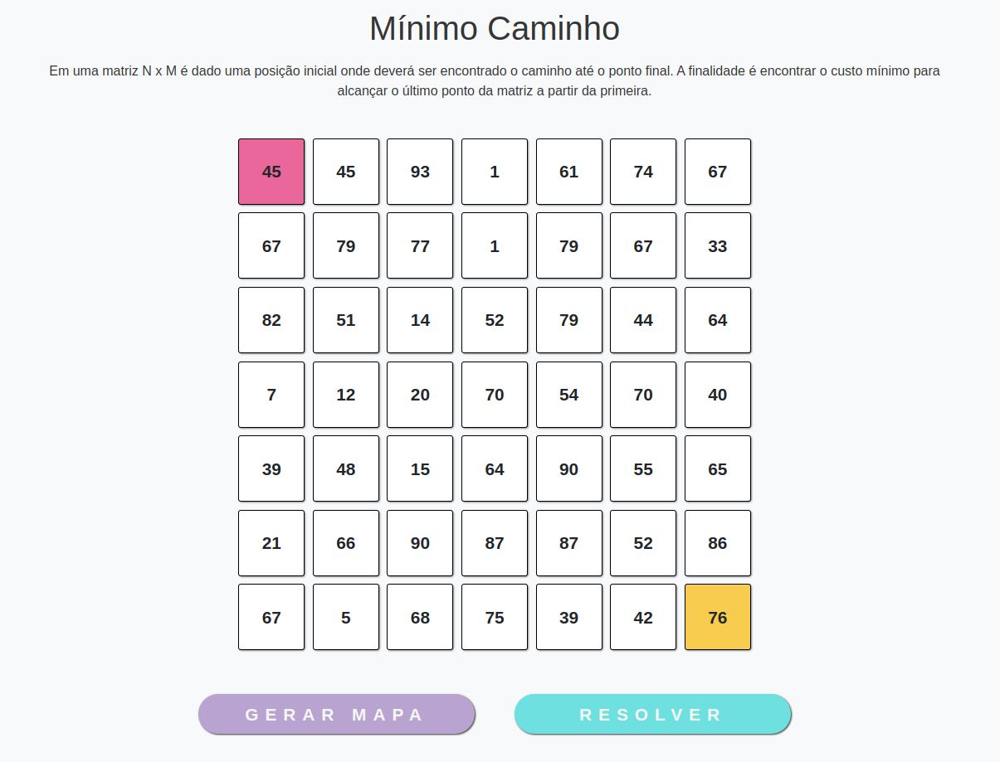
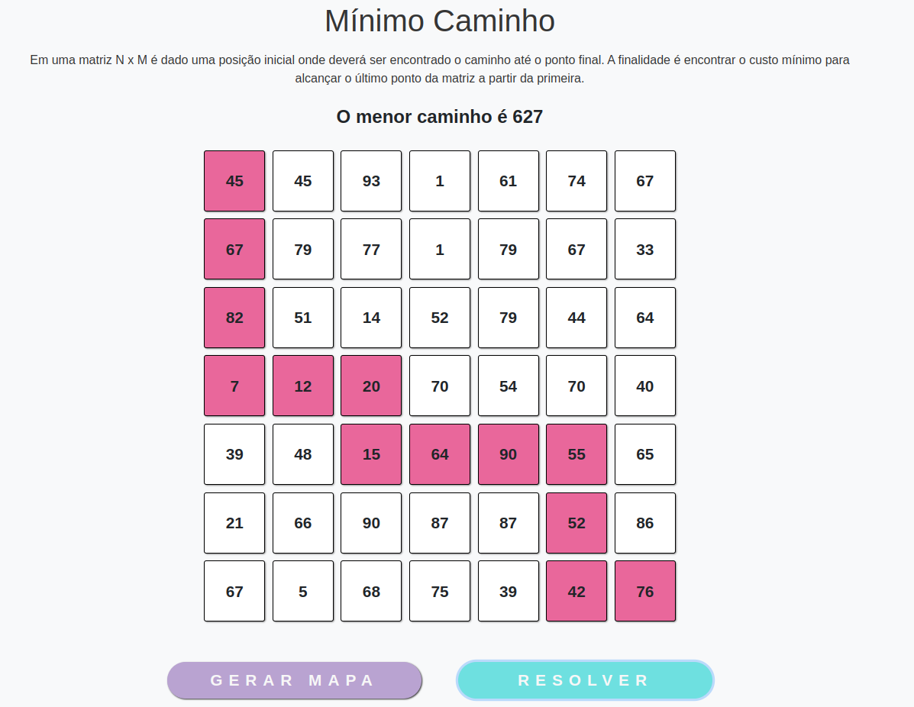
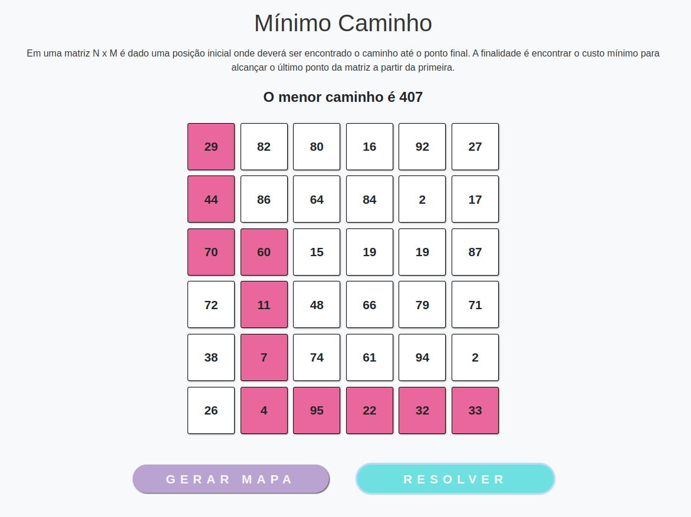

# Mínimo Caminho

**Número da Lista**: 5<br>
**Conteúdo da Disciplina**: Programação Dinâmica<br>

## Alunos
|Matrícula | Aluno |
| -- | -- |
| 18/0106821  |  Mateus Gomes do Nascimento |
| 18/0132245  |  Vinicius de Sousa Saturnino |

## Sobre 
Em uma matriz N x M é dado uma posição inicial onde deverá ser encontrado o caminho até o ponto final. A finalidade é encontrar o custo mínimo para alcançar o último ponto da matriz a partir da primeira.

## Screenshots







## Instalação 
**Linguagem**: JavaScript<br>
**Framework**: ReactJS<br>

```bash
yarn
```

```bash
yarn start
```

## Uso 
Acesse o endereço no navegador:

`http://localhost:3000`

## Outros 
Quaisquer outras informações sobre seu projeto podem ser descritas abaixo.

